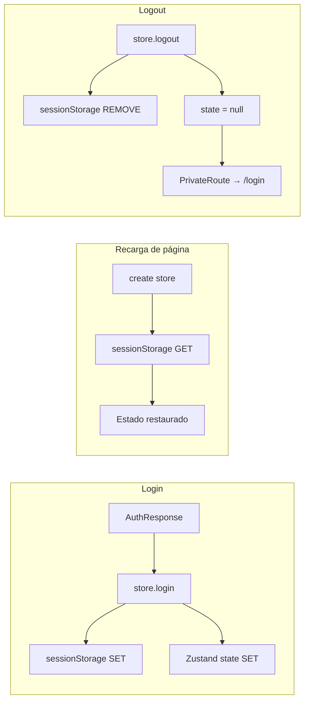

# 03 Frontend > Estado Global y Autenticación

> Prerrequisitos: [Sistema de rutas](02_sistema_rutas.md)

Fuente: `packages/frontend/src/store/authStore.ts`

## Zustand Store

```typescript
type AuthState = {
  token: string | null
  customerId: number | null
  role: string | null
  login: (token: string, customerId: number, role: string) => void
  logout: () => void
}

export const useAuthStore = create<AuthState>((set) => ({
  // Inicialización desde sessionStorage
  token: sessionStorage.getItem('token'),
  customerId: sessionStorage.getItem('customerId')
    ? Number(sessionStorage.getItem('customerId'))
    : null,
  role: sessionStorage.getItem('role'),

  login: (token, customerId, role) => {
    sessionStorage.setItem('token', token)
    sessionStorage.setItem('customerId', String(customerId))
    sessionStorage.setItem('role', role)
    set({ token, customerId, role })
  },

  logout: () => {
    sessionStorage.removeItem('token')
    sessionStorage.removeItem('customerId')
    sessionStorage.removeItem('role')
    set({ token: null, customerId: null, role: null })
  },
}))
```

## Ciclo de vida



## Puntos de uso

| Dónde | Qué lee | Cómo |
|-------|---------|------|
| **PrivateRoute** | `token` | `useAuthStore((s) => s.token)` — si null, redirige a login |
| **Axios interceptor** | `token` | `useAuthStore.getState().token` — fuera de React, acceso directo |
| **useProfile hook** | `customerId` | `useAuthStore((s) => s.customerId)` — para query key |
| **useCards hook** | `customerId` | Idem |
| **useToggleCard** | `customerId` | Para invalidar cache |
| **SidebarNav** | `logout` | Botón "Cerrar sesión" llama `store.logout()` |

## No usa Zustand `persist`

La persistencia es **manual** con `sessionStorage`. No usa el middleware `persist` de Zustand.

Esto significa que:
- Los datos persisten durante la sesión del navegador
- Se pierden al cerrar la pestaña/ventana
- Se restauran al recargar la página (F5)
- Se pierden al abrir una nueva pestaña (cada pestaña tiene su propia sesión)

## Token en Axios (fuera de React)

```typescript
// services/api.ts
api.interceptors.request.use((config) => {
  const token = useAuthStore.getState().token  // Acceso directo al store, no hook
  if (token) config.headers.Authorization = `Bearer ${token}`
  return config
})
```

Se usa `.getState()` en vez de un hook porque el interceptor de Axios está **fuera del árbol de React**.

## Documentos relacionados

- [Autenticación JWT (backend)](../04_backend/02_autenticacion_jwt.md) — cómo se genera el token
- [Capa de servicios](04_capa_servicios.md) — Axios interceptor
- [Diagrama de login](../diagramas/flujo_login.md) — flujo completo
