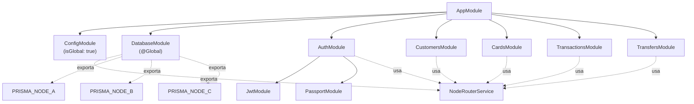

# 04 Backend > Arquitectura NestJS

> Prerrequisitos: [Arquitectura del sistema](../01_vision_general/01_arquitectura_sistema.md)

## Bootstrap

Archivo: `packages/backend/src/main.ts`

```typescript
const app = await NestFactory.create(AppModule);
app.setGlobalPrefix('api');                    // Todas las rutas empiezan con /api
app.enableCors({
  origin: ['http://localhost:5173', 'http://localhost:3000'],
  credentials: true,
});
app.useGlobalPipes(new ValidationPipe({
  whitelist: true,              // Remueve propiedades no declaradas en el DTO
  forbidNonWhitelisted: true,   // Error si envían propiedades extra
  transform: true,              // Auto-cast de tipos (string → number)
}));
await app.listen(3000);
```

## Módulos

Archivo: `packages/backend/src/app.module.ts`



## Patrón Controller → Service

Todos los módulos de negocio siguen el mismo patrón:

1. **Controller** (`*.controller.ts`): Define las rutas HTTP, aplica guards, parsea parámetros
2. **Service** (`*.service.ts`): Lógica de negocio, acceso a BD via `NodeRouterService`
3. **DTO** (`dto/*.dto.ts`): Validación de entrada con decoradores `class-validator`

```
Request HTTP → Controller (@UseGuards, @Param, @Body)
  → Service (lógica + NodeRouterService → Prisma → PostgreSQL)
  → Response JSON
```

## Módulos del sistema

| Módulo | Archivos | Endpoints | Propósito |
|--------|----------|-----------|-----------|
| **ConfigModule** | (built-in NestJS) | — | Variables de entorno (isGlobal) |
| **DatabaseModule** | 3 archivos | — | 3 instancias Prisma + NodeRouterService |
| **AuthModule** | 6 archivos | `POST /api/auth/login` | Login, JWT, guards |
| **CustomersModule** | 3 archivos | `GET /api/customers/:id/profile` | Perfil + cuentas |
| **CardsModule** | 4 archivos | `GET cards`, `PATCH toggle` | Tarjetas |
| **TransactionsModule** | 3 archivos | `GET by account`, `GET by uuid` | Consulta de transacciones |
| **TransfersModule** | 4 archivos | `POST /api/transfers` | Ejecución de transferencias SAGA |

## Decoradores más usados

| Decorador | Archivo | Propósito |
|-----------|---------|-----------|
| `@UseGuards(JwtAuthGuard)` | Controllers | Proteger endpoint con JWT |
| `@Req() req` | Controllers | Acceder a `req.user.customerId` |
| `@Param('id', ParseIntPipe)` | Controllers | Parsear parámetros de URL |
| `@Body()` | Controllers | Body validado por DTO |
| `@Injectable()` | Services | Hacer inyectable por DI |
| `@Global()` | DatabaseModule | Disponible sin importar |

## Documentos relacionados

- [Autenticación JWT](02_autenticacion_jwt.md) — cómo funciona el auth
- [Módulo Database](03_modulo_database.md) — routing a 3 nodos
- [Estructura del monorepo](../01_vision_general/03_estructura_monorepo.md) — árbol de archivos
