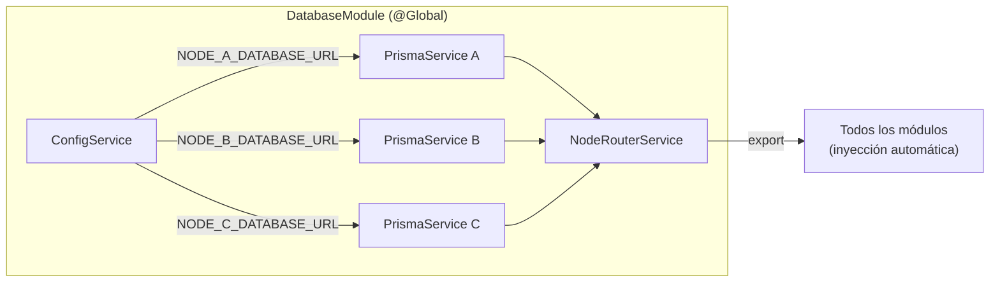

# 04 Backend > Módulo Database

> Prerrequisitos: [Distribución de nodos](../05_base_datos/03_distribucion_nodos.md)

## Visión general

El `DatabaseModule` es el componente más distintivo de la arquitectura. Es un módulo **@Global** que provee:
- 3 instancias de `PrismaService` (una por nodo PostgreSQL)
- `NodeRouterService` que decide qué instancia usar para cada operación

## DatabaseModule (`src/database/database.module.ts`)



Cada `PrismaService` se crea como factory provider:

```typescript
{
  provide: 'PRISMA_NODE_A',
  useFactory: (config: ConfigService) => {
    const url = config.getOrThrow<string>('NODE_A_DATABASE_URL');
    return new PrismaService(url);
  },
  inject: [ConfigService],
}
```

Los 3 Prisma clients y el `NodeRouterService` se **exportan** para que cualquier módulo pueda inyectarlos.

## PrismaService (`src/database/prisma.service.ts`)

Extiende `PrismaClient` con conexión dinámica:

```typescript
export class PrismaService extends PrismaClient {
  constructor(url: string) {
    super({ datasources: { db: { url } } });
  }
  async onModuleInit() { await this.$connect(); }
  async onModuleDestroy() { await this.$disconnect(); }
}
```

## NodeRouterService (`src/database/node-router.service.ts`)

El cerebro del routing distribuido. Métodos:

| Método | Parámetro | Retorno | Uso |
|--------|-----------|---------|-----|
| `getNodeForCustomer(id)` | customer_id | `'nodo-a' \| 'nodo-b' \| 'nodo-c'` | Determinar nombre del nodo |
| `getPrismaForCustomer(id)` | customer_id | `PrismaService` | **Método más usado** — obtener conexión para un cliente |
| `getPrismaForNode(node)` | NodeId | `PrismaService` | Acceso directo por nombre de nodo |
| `getAllNodes()` | — | `PrismaService[]` | Búsqueda cross-node (login, buscar cuenta) |
| `findAccountNodeByNumber(num)` | account_number | `{ node, prisma } \| null` | Buscar cuenta destino en transferencias |

### Algoritmo de routing

```typescript
getNodeForCustomer(customerId: number): NodeId {
  const mod = customerId % 3;
  if (mod === 0) return 'nodo-a';
  if (mod === 1) return 'nodo-b';
  return 'nodo-c';
}
```

### Patrón de uso en services

Todos los services siguen el mismo patrón:

```typescript
@Injectable()
export class SomeService {
  constructor(private readonly nodeRouter: NodeRouterService) {}

  async someMethod(customerId: number) {
    const prisma = this.nodeRouter.getPrismaForCustomer(customerId);
    // Usar prisma para queries...
  }
}
```

## Documentos relacionados

- [Distribución de nodos](../05_base_datos/03_distribucion_nodos.md) — lógica de partición
- [Variables de entorno](../02_inicio_rapido/05_variables_entorno.md) — URLs de conexión
- [Transferencias SAGA](05_modulo_transfers_saga.md) — uso avanzado con cross-node
