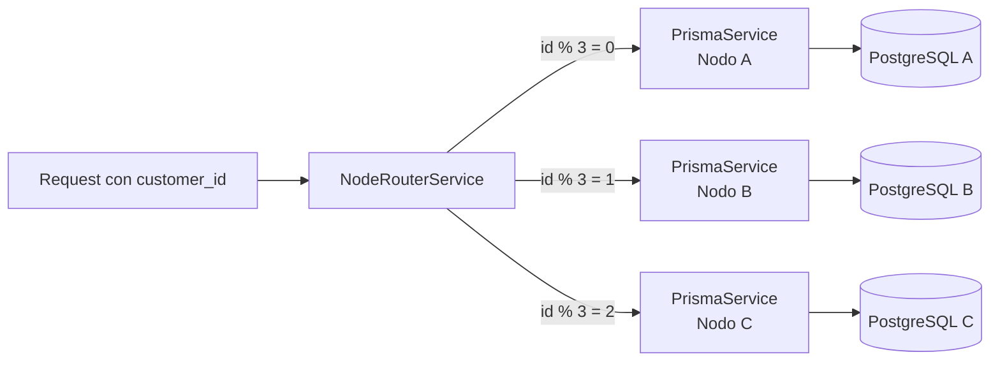

# 05 Base de Datos > Distribución de Nodos

> Prerrequisitos: [Esquema ER](01_esquema_er.md)

## Estrategia de partición

La base de datos está particionada **horizontalmente** por `customer_id` usando módulo 3:

```
customer_id % 3 = 0  →  Nodo A
customer_id % 3 = 1  →  Nodo B
customer_id % 3 = 2  →  Nodo C
```

## Implementación en código

Archivo: `packages/backend/src/database/node-router.service.ts`

```typescript
getNodeForCustomer(customerId: number): NodeId {
  const mod = customerId % 3;
  if (mod === 0) return 'nodo-a';
  if (mod === 1) return 'nodo-b';
  return 'nodo-c';
}
```

## Infraestructura de los nodos

| Nodo | Hosting | Puerto default | Variable de entorno | Clientes |
|------|---------|---------------|--------------------|---------  |
| **Nodo A** | Local (PostgreSQL) | 5432 | `NODE_A_DATABASE_URL` | id % 3 = 0 (ej: 0, 3, 6, 9, ..., 27) |
| **Nodo B** | Local (PostgreSQL) | 5433 | `NODE_B_DATABASE_URL` | id % 3 = 1 (ej: 1, 4, 7, 10, ...) |
| **Nodo C** | Supabase (cloud) | — | `NODE_C_DATABASE_URL` | id % 3 = 2 (ej: 2, 5, 8, 11, ...) |

## Ejemplo con el usuario demo

**Natalia Ruiz Castillo** tiene `customer_id = 27`:
- 27 % 3 = **0** → reside en **Nodo A**
- Sus cuentas (id=27, id=43), tarjetas y transacciones están en Nodo A
- Las cuentas destino de sus transferencias pueden estar en **cualquier nodo**

## Schema idéntico en los 3 nodos

Los 3 nodos ejecutan el **mismo DDL** (`00_ddl_base.sql`). Las 6 tablas existen en las 3 bases de datos, pero cada nodo solo contiene los datos de su subconjunto de clientes.

```
Nodo A: customers + accounts + cards + transactions (de clientes con id % 3 = 0)
Nodo B: customers + accounts + cards + transactions (de clientes con id % 3 = 1)
Nodo C: customers + accounts + cards + transactions (de clientes con id % 3 = 2)
```

## Operaciones por tipo

### Lectura (siempre local)
Las queries de perfil, cuentas, tarjetas y transacciones siempre van al **nodo del cliente**:

```typescript
const prisma = this.nodeRouter.getPrismaForCustomer(customerId);
// Todas las queries usan esta instancia
```

### Búsqueda de email (cross-node)
El login busca el email **secuencialmente** en los 3 nodos:

```typescript
for (const prisma of this.nodeRouter.getAllNodes()) {
  const customer = await prisma.customers.findUnique({ where: { email } });
  if (customer) return customer;
}
```

### Búsqueda de cuenta destino (cross-node)
Al crear una transferencia, se busca la cuenta destino en los 3 nodos:

```typescript
async findAccountNodeByNumber(accountNumber: string) {
  for (const [node, prisma] of Object.entries(this.prismaInstances)) {
    const account = await prisma.accounts.findUnique({
      where: { account_number: accountNumber },
    });
    if (account) return { node, prisma };
  }
  return null;
}
```

### Transferencia intra-nodo
Si ambas cuentas están en el mismo nodo → ejecución directa, todo en un nodo.

### Transferencia cross-nodo
Si las cuentas están en nodos diferentes → patrón SAGA con compensación.
Ver [Módulo Transfers SAGA](../04_backend/05_modulo_transfers_saga.md).

## Diagrama de routing



## Documentos relacionados

- [Módulo Database](../04_backend/03_modulo_database.md) — implementación del DatabaseModule
- [Transferencias SAGA](../04_backend/05_modulo_transfers_saga.md) — cross-node transfer
- [DDL y datos](04_ddl_y_datos.md) — scripts SQL
- [Spec de fragmentación](../../packages/frontend/docs/spec_distribank_doc/07_fragmentacion_algebra.md) — álgebra relacional
