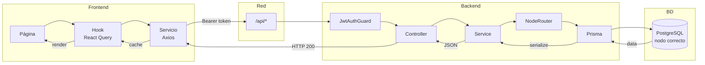
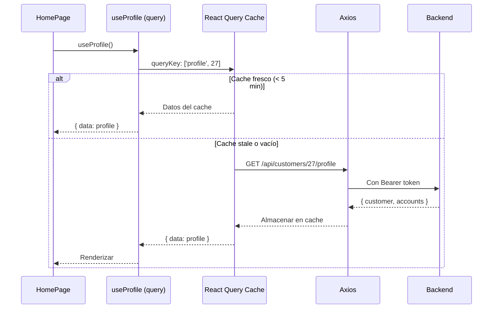

# 06 Contrato API > Flujos de Secuencia

> Prerrequisitos: [Catálogo de endpoints](01_catalogo_endpoints.md)

## Diagramas disponibles

Los diagramas de secuencia detallados están en el directorio `diagramas/`:

| Flujo | Diagrama | Componentes involucrados |
|-------|----------|-------------------------|
| **Login completo** | [flujo_login.md](../diagramas/flujo_login.md) | LoginPage → Zod → useLogin → Axios → AuthController → AuthService → bcrypt → JWT → Zustand → sessionStorage |
| **Transferencia** | [flujo_transferencia.md](../diagramas/flujo_transferencia.md) | TransferPage → TransferConfirmPage → useTransfer → TransfersService → NodeRouter → SAGA intra/cross |
| **Toggle tarjeta** | [flujo_toggle_tarjeta.md](../diagramas/flujo_toggle_tarjeta.md) | CardDetailPage → CardControlSwitch → Modal → useToggleCard → CardsService → invalidate cache |

## Flujo genérico de datos

## Flujo de carga inicial (HomePage)

## Documentos relacionados

- [Hooks React Query](../03_frontend/05_hooks_react_query.md) — query keys y invalidación
- [Capa de servicios](../03_frontend/04_capa_servicios.md) — Axios interceptor
- [Catálogo de endpoints](01_catalogo_endpoints.md) — detalle de cada endpoint
