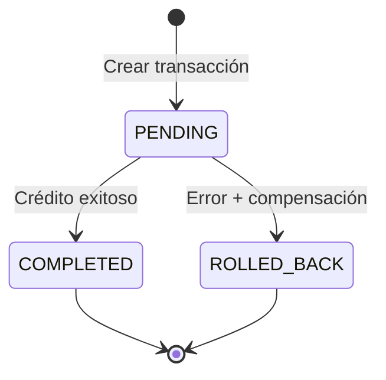

# 07 Reglas de Negocio > Dominio de Transferencias

> Prerrequisitos: [Dominio de cuentas](01_dominio_cuentas.md), [Distribución de nodos](../05_base_datos/03_distribucion_nodos.md)

## Validaciones previas

| # | Validación | Error si falla |
|---|-----------|---------------|
| 1 | `transaction_uuid` no existe (idempotencia) | Retorna resultado existente (no es error) |
| 2 | Cuenta origen existe en el nodo del cliente | 400: "Cuenta origen no encontrada" |
| 3 | Saldo suficiente (CHECKING: `balance + overdraft`, CREDIT: `available_credit`) | 400: "Saldo insuficiente..." |
| 4 | Cuenta destino existe en algún nodo | 400: "Cuenta destino no encontrada" |
| 5 | Cuenta origen ≠ cuenta destino | 400: "La cuenta origen y destino no pueden ser la misma" |

## Idempotencia

El frontend genera un **UUID v4** antes de enviar la transferencia. Si el usuario reintenta (doble click, retry), el backend detecta que el UUID ya existe y retorna el resultado anterior sin re-ejecutar.

```
1er intento: UUID abc → crear transacción → retorna COMPLETED
2do intento: UUID abc → encuentra existente → retorna COMPLETED (sin nueva operación)
```

## Tipos de transferencia

### Intra-nodo
Ambas cuentas residen en el **mismo nodo PostgreSQL**.
- Ejecución directa (sin SAGA)
- Status final: `COMPLETED`

### Cross-nodo
Las cuentas están en **nodos diferentes**.
- Ejecución con patrón SAGA y compensación
- Status final: `COMPLETED` o `ROLLED_BACK`

Ver [diagrama de secuencia](../diagramas/flujo_transferencia.md).

## Patrón SAGA



### Flujo exitoso (cross-node)
1. Crear transacción PENDING en nodo origen
2. Log: INITIATED → DEBIT_APPLIED
3. Decrementar balance cuenta origen
4. Incrementar balance cuenta destino (otro nodo)
5. Log: CREDIT_APPLIED → COMPLETED
6. Update status → COMPLETED

### Flujo con rollback (cross-node)
1-3. Igual al exitoso
4. **Error** al incrementar en nodo destino
5. **Compensación:** Revertir decrement en cuenta origen
6. Log: FAILED → COMPENSATED
7. Update status → ROLLED_BACK

## Transaction Log (Event Sourcing)

Cada transferencia genera eventos inmutables:

| Evento | Significado | Nodo |
|--------|-----------|------|
| `INITIATED` | Transacción creada | Origen |
| `DEBIT_APPLIED` | Débito aplicado a cuenta origen | Origen |
| `CREDIT_APPLIED` | Crédito aplicado a cuenta destino | Destino |
| `COMPLETED` | Transacción finalizada con éxito | Origen |
| `FAILED` | Error en nodo destino | Destino |
| `COMPENSATED` | Compensación (rollback) aplicada | Origen |

Ver [estados de transacción](../diagramas/estados_transaccion.md).

## Documentos relacionados

- [Módulo Transfers SAGA](../04_backend/05_modulo_transfers_saga.md) — implementación
- [Dominio de transacciones](04_dominio_transacciones.md) — consulta y timeline
