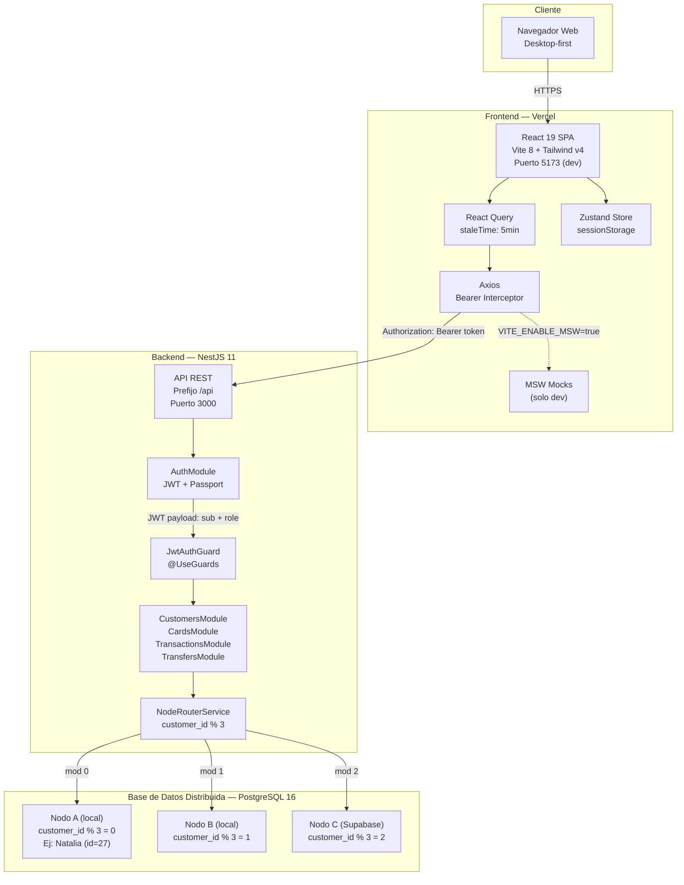

# Diagrama de Arquitectura General

## Flujo de una request típica

1. **Browser** renderiza la SPA React servida por Vercel (o Vite dev server)
2. **React Query** gestiona el ciclo de vida del dato (cache, stale, refetch)
3. **Axios** inyecta el `Bearer token` desde Zustand y envía la request
4. En desarrollo, **MSW** intercepta la request antes de que salga del navegador
5. En producción, la request llega al **Backend NestJS** en `/api/*`
6. **JwtAuthGuard** valida el token y extrae `{ customerId, role }` al `req.user`
7. El controller delega al service, que usa **NodeRouterService** para obtener la instancia Prisma correcta
8. **Prisma** ejecuta la query contra el **nodo PostgreSQL** correspondiente
9. La respuesta recorre el camino inverso: Service → Controller → HTTP → Axios → React Query cache → UI
