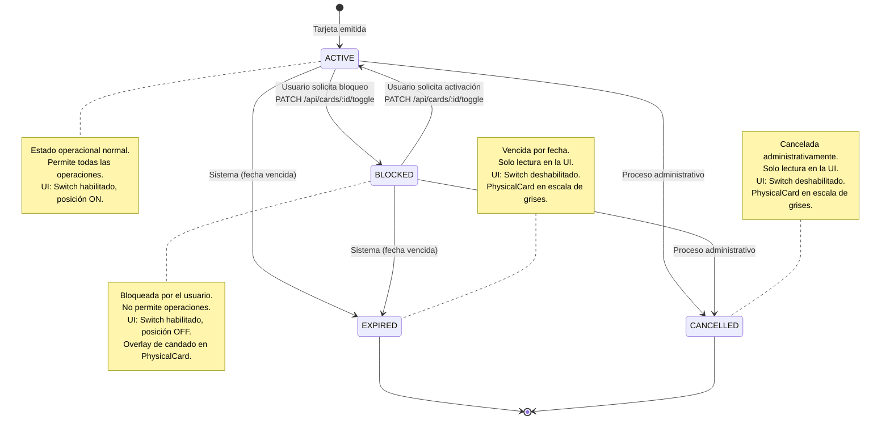

# Diagrama de Estados — Tarjetas

## Reglas de transición

| Transición | Iniciada por | Endpoint | HTTP Error si inválida |
|-----------|-------------|----------|----------------------|
| ACTIVE → BLOCKED | Usuario | `PATCH /api/cards/:id/toggle` | — |
| BLOCKED → ACTIVE | Usuario | `PATCH /api/cards/:id/toggle` | — |
| ACTIVE → EXPIRED | Sistema | Automático por fecha | — |
| BLOCKED → EXPIRED | Sistema | Automático por fecha | — |
| EXPIRED → ACTIVE | No permitida | — | 409 Conflict |
| EXPIRED → BLOCKED | No permitida | — | 409 Conflict |
| CANCELLED → * | No permitida | — | 409 Conflict |

## UI en CardDetailPage

- **ACTIVE/BLOCKED**: `CardControlSwitch` habilitado con modal de confirmación
- **EXPIRED/CANCELLED**: `CardControlSwitch` deshabilitado (read-only)
- **BLOCKED**: `PhysicalCard` muestra overlay con icono de candado
- **EXPIRED/CANCELLED**: `PhysicalCard` muestra filtro grayscale

Fuente: `packages/backend/src/cards/cards.service.ts`, `packages/frontend/src/components/cards/CardControlSwitch.tsx`
