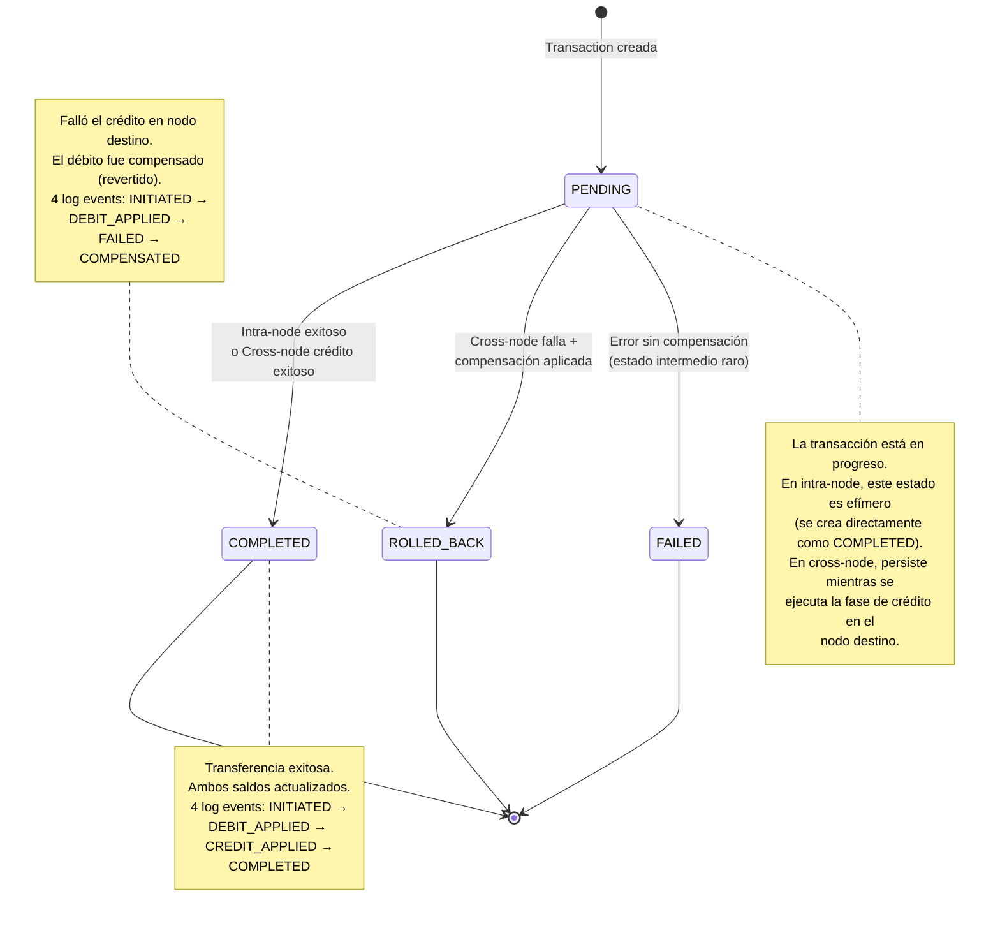
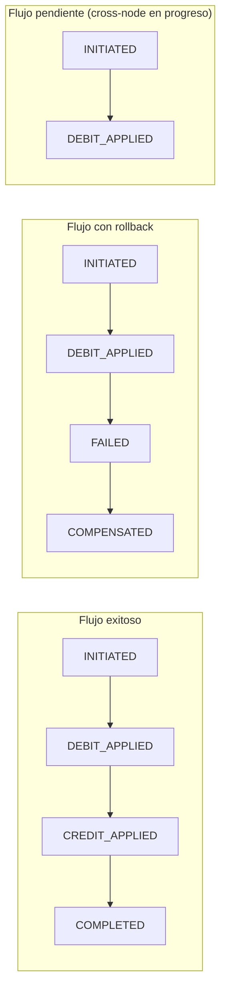

# Diagrama de Estados — Transacciones

## Eventos del Transaction Log

## Relación estado ↔ eventos

| Status | Eventos esperados | Significado |
|--------|-------------------|-------------|
| `COMPLETED` | INITIATED → DEBIT_APPLIED → CREDIT_APPLIED → COMPLETED | Todo exitoso |
| `PENDING` | INITIATED → DEBIT_APPLIED | Esperando crédito en destino |
| `FAILED` | INITIATED → DEBIT_APPLIED → FAILED | Error sin compensar (raro) |
| `ROLLED_BACK` | INITIATED → DEBIT_APPLIED → FAILED → COMPENSATED | Error + compensación |

Fuente: `packages/backend/src/transfers/transfers.service.ts:78-206`
