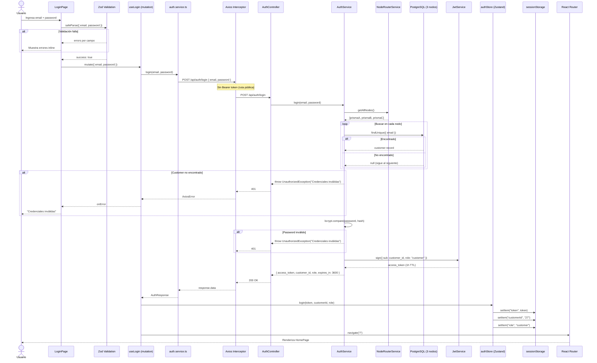

# Diagrama de Secuencia — Login

## Notas

- La búsqueda de email es **secuencial** por los 3 nodos (`auth.service.ts:36-41`). Esto significa que el nodo donde reside el cliente afecta la latencia de login.
- El token JWT tiene TTL de 1 hora. No hay refresh token implementado — al expirar, el usuario debe volver a loguearse.
- `sessionStorage` persiste el estado solo durante la sesión del navegador (se pierde al cerrar la pestaña).
