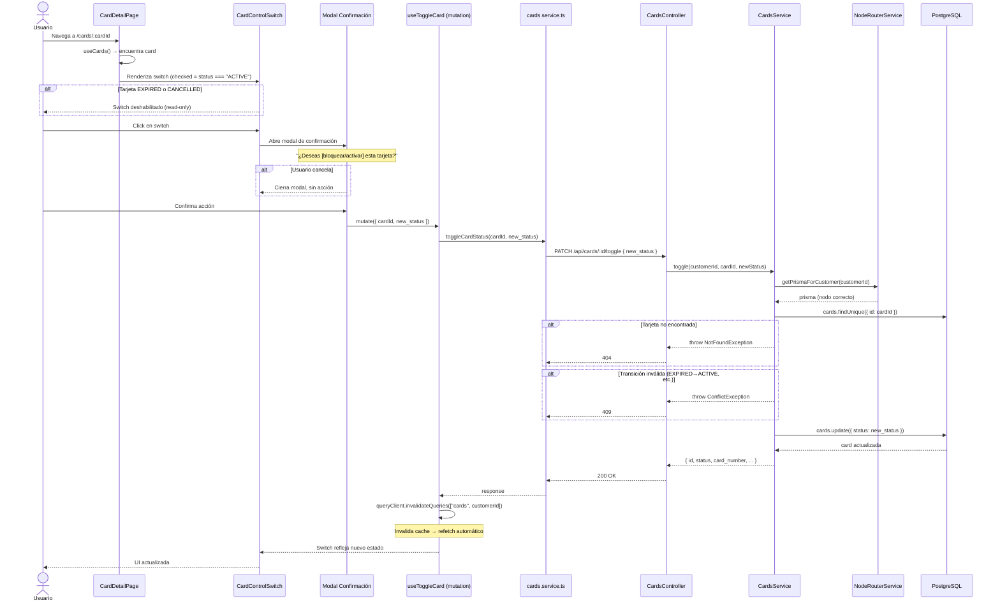

# Diagrama de Secuencia — Toggle de Tarjeta

## Transiciones de estado válidas

Solo `ACTIVE ↔ BLOCKED` es una transición válida. Ver [estados_tarjeta.md](estados_tarjeta.md).

| Estado actual | → ACTIVE | → BLOCKED | → EXPIRED | → CANCELLED |
|--------------|----------|-----------|-----------|-------------|
| ACTIVE | - | OK | Solo sistema | Solo sistema |
| BLOCKED | OK | - | Solo sistema | Solo sistema |
| EXPIRED | 409 | 409 | - | - |
| CANCELLED | 409 | 409 | - | - |
