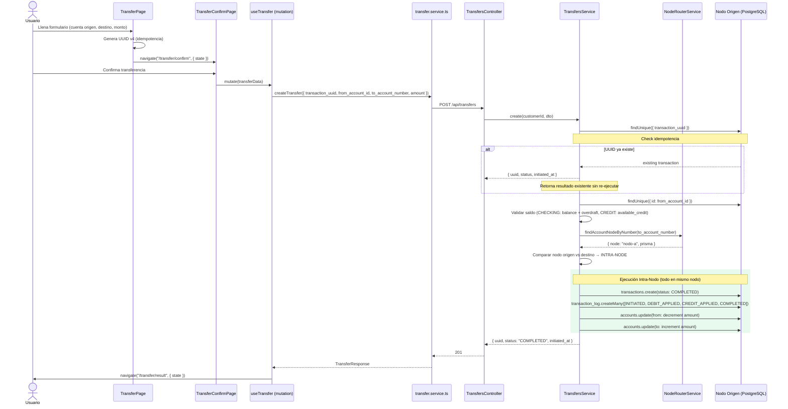
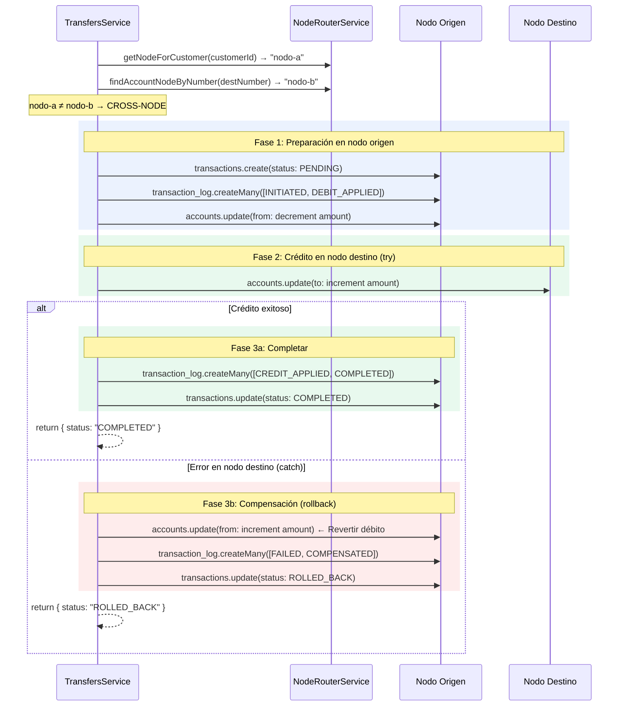

# Diagrama de Secuencia — Transferencias

## Transferencia Intra-Nodo (ambas cuentas en el mismo nodo)

## Transferencia Cross-Nodo (cuentas en nodos diferentes)

## Eventos del Transaction Log por escenario

| Escenario | Eventos | Nodos involucrados |
|-----------|---------|-------------------|
| Intra-node OK | INITIATED → DEBIT_APPLIED → CREDIT_APPLIED → COMPLETED | Mismo nodo para todos |
| Cross-node OK | INITIATED → DEBIT_APPLIED → CREDIT_APPLIED → COMPLETED | Origen, Origen, Destino, Origen |
| Cross-node FAIL | INITIATED → DEBIT_APPLIED → FAILED → COMPENSATED | Origen, Origen, Destino, Origen |

Los timestamps de los log events se espacian 1 segundo entre sí (`transfers.service.ts:93-99`).
