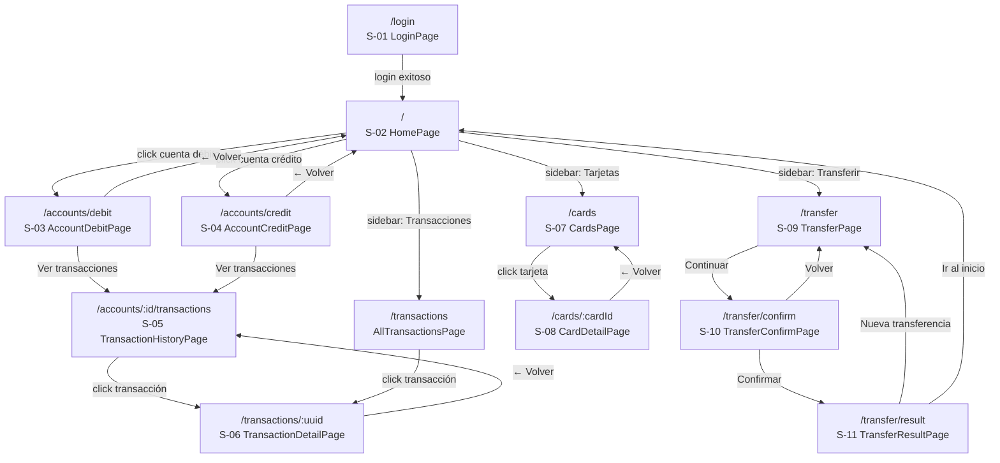
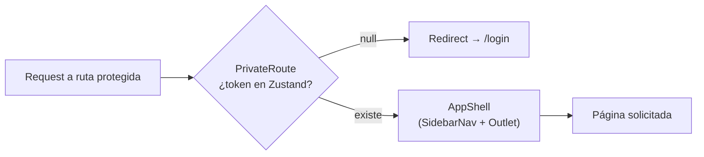

# Diagrama de Navegación del SPA

## Protección de rutas

## Mapa de rutas completo

| Ruta | Página | Spec | Protegida |
|------|--------|------|-----------|
| `/login` | LoginPage | S-01 | No |
| `/` | HomePage | S-02 | Sí |
| `/accounts/debit` | AccountDebitPage | S-03 | Sí |
| `/accounts/credit` | AccountCreditPage | S-04 | Sí |
| `/accounts/:accountId/transactions` | TransactionHistoryPage | S-05 | Sí |
| `/transactions` | AllTransactionsPage | — | Sí |
| `/transactions/:uuid` | TransactionDetailPage | S-06 | Sí |
| `/cards` | CardsPage | S-07 | Sí |
| `/cards/:cardId` | CardDetailPage | S-08 | Sí |
| `/transfer` | TransferPage | S-09 | Sí |
| `/transfer/confirm` | TransferConfirmPage | S-10 | Sí |
| `/transfer/result` | TransferResultPage | S-11 | Sí |

Fuente: `packages/frontend/src/router/index.tsx`
